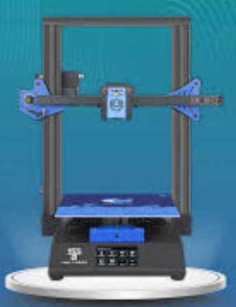
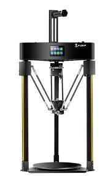

# 3DPrinterConfig
My 3D Printers Configuration backup:

## Printer List:
01 | 02 | 03 | 04 | 05
--------|------|------|------|------
 |  |  |  | 
[MPSM Wiki](https://mpselectmini.com/)| [MPMD Wiki](https://mpminidelta.com/)| [TTBluer](bluer/README.md)|[Q5](q5/README.md)|[KP3S](kp3s/README.md)

Using fallowing firmware:

Firmware|Example Boards
--------|------
[[Klipper]](https://www.klipper3d.org/) | 
[[Marlin]](https://marlinfw.org/) | 

## Guide:
[~MKS TS35 KlipperScreen~](https://github.com/willngton/3DPrinterConfig/tree/main/mks_ts35)
