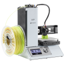
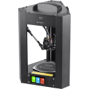

# 3DPrinterConfig
My 3D Printers Configuration backup:

## Printer List:

Printer|More Info
--------|------
| [MPSM Wiki](https://mpselectmini.com/) 
| [MPMD Wiki](https://mpminidelta.com/) 

Using fallowing firmware:

Firmware|Example Boards
--------|------
[[Klipper]](https://www.klipper3d.org/) | 
[[Marlin]](https://marlinfw.org/) | 
  
  

  
  
 

