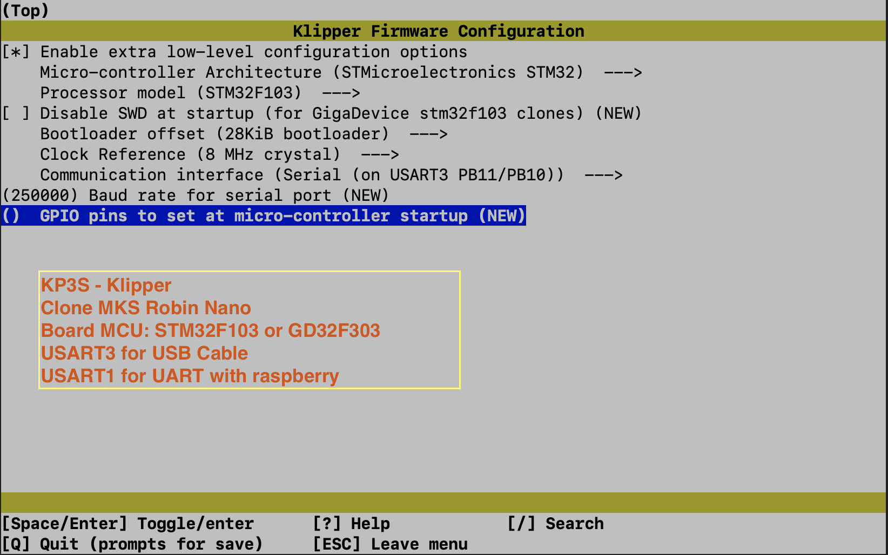

## Kingroom KP3S 3.0

<br /><br />
### Machine Configuration 
  - MKS TMC 2209 - Uart
  - 3D Touch for autoleveling
  - Running Klipper
  - BMG Extruder

### Klipper Firmware Build - STM32F103 and GD32F303 mcu
  - Create fimware bin following bellow image
```
cd /home/pi/klipper
make menu-config 
```

<p align="left">
  
</p>

```
make clean
make
```
- Convert klipper bin using mks python script, from inside _/home/pi/klipper/_ folder.
```
./scripts/update_mks_robin.py out/klipper.bin out/Robin_nano.bin
```
  - Copy Robin_nano.bin to sd-card: You can move Robin_nano.bin from out folder to klipper_config and dowload using web interface, no need winscp, scp.. etc.
  ```
     mv /home/pi/klipper/out/klipper.bin out/Robin_nano.bin /home/pi/klipper_config/
  ```
  - Flash Board
  - Happy Printing

