# MKS TS35 KlippeScreem port!

## Notes and guide on how to use MKS TS35 LCD with KlipperScreem

Two Trees Bluer | 
--------|
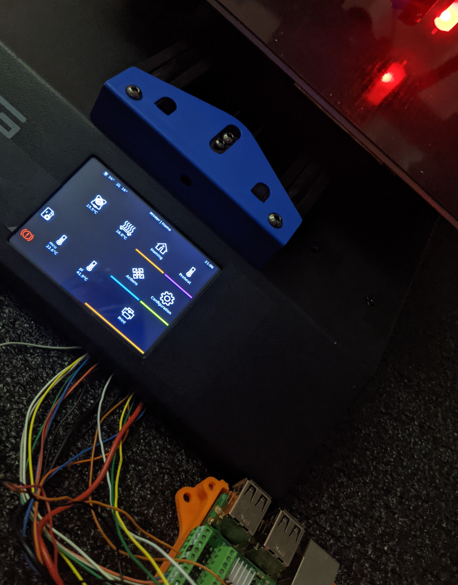 |

MKS TS35 Guide for KlipperScreen connected to a raspberry pi via SPI : @willngton

> Note: Considering that you already have installed: Klipper + KlipperScreen using KIAUH in a clean Raspbian Lite


* 1 MKS TS35 Wiring to Raspberry PI (one may connect BEEP pin to any free gpio on PI for M300)


PINOUT | 
--------|
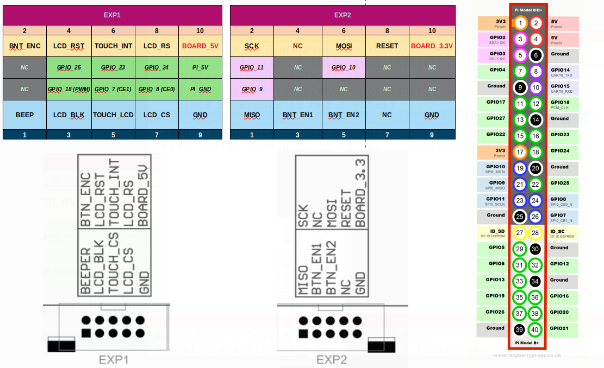 |


* 2 Add the fallowing lines on your /boot/config.txt, this will force screen size to match with TS35, enable SPI and tinylcd35 dtoverlay.
```
###### MKS TS35
hdmi_force_hotplug=1
hdmi_cvt=hdmi_cvt=400 300 60 1 0 0 0
hdmi_group=2
hdmi_mode=1
hdmi_mode=87
display_rotate=0

dtparam=spi=on
dtoverlay=tinylcd35,rotate=270,speed=36000000,touch,touchgpio=23,fps=10 # MKS TS35 Rotated 270 (for fit on Two Trees Bluer)
```
* 3 Install rpi-fbcp for screen redirection.
```
sudo apt-get install cmake
cd ~
sudo git clone https://github.com/tasanakorn/rpi-fbcp
cd rpi-fbcp/
mkdir build
cd build
sudo cmake ..
sudo make
sudo install fbcp /usr/local/bin/fbcp
```

* 4 Add  "fbcp &" to /etc/rc.local.
  > Use your favorite text editor and add "fbcp &" to your rd.local in order get it up at boot time.

* 5 Install xserver-xorg-input-evdev
```
sudo apt-get install xserver-xorg-input-evdev
```

### Touch Screen Configuration, this will enable touch using ADS7846

* 6 If does not exists, create a file on /usr/share/X11/xorg.conf.d/99-fbturbo.conf with the fallowing content, you may need to try /dev/fb0 or /dev/fb1 based on if you get output or not.

```
# This is a minimal sample config file, which can be copied to
# /etc/X11/xorg.conf in order to make the Xorg server pick up
# and load xf86-video-fbturbo driver installed in the system.
#
# When troubleshooting, check /var/log/Xorg.0.log for the debugging
# output and error messages.
# Run "man fbturbo" to get additional information about the extra
# configuration options for tuning the driver.

Section "Device"
        Identifier      "Allwinner A10/A13/A20 FBDEV"
        Driver          "fbturbo"
        Option          "fbdev" "/dev/fb0"
        Option          "SwapbuffersWait" "true"
EndSection

```

* 7 If does not exists, create a file on - /etc/X11/xorg.conf.d/99-calibration.conf with the fallowing content.

> For Two Trees Bluer, diplay need to be installed rotated 270, therefore calibarion point should be.
```
Section "InputClass"
        Identifier      "calibration"
        MatchProduct    "ADS7846 Touchscreen"
        Option  "Calibration"   "227 3936 3880 268"
        Option  "SwapAxes"      "1"
        Option "EmulateThirdButton" "1"
        Option "EmulateThirdButtonTimeout" "1000"
        Option "EmulateThirdButtonMoveThreshold" "300"
EndSection
```

> For diplay rotated 270.
```
Section "InputClass"
        Identifier      "calibration"
        MatchProduct    "ADS7846 Touchscreen"
        Option  "Calibration"   "3936 227 268 3880"
        Option  "SwapAxes"      "1"
        Option "EmulateThirdButton" "1"
        Option "EmulateThirdButtonTimeout" "1000"
        Option "EmulateThirdButtonMoveThreshold" "300"
EndSection
```

* 8 Replace tinylcd35 dtoverlay for the one found on:
>https://forums.raspberrypi.com/viewtopic.php?t=281695

>https://drive.google.com/file/d/1naCs1F-VGU9CJnzmOeAstpQY-9Bypno2/view?usp=sharing

Download and replace using the fallowing command
```
sudo cp tinylcd35.dtbo.1 /boot/overlays/tinylcd35.dtbo
```

* 9 Reboot your system

### This is based on varius tutorials, if you found a better way to do it, please share.

* 10 Troubleshooting
> You can basically fallow the steps on KlipperScreen documentation: https://klipperscreen.readthedocs.io/en/latest/Troubleshooting/

> https://forums.raspberrypi.com/viewtopic.php?t=143581

> https://forums.raspberrypi.com/viewtopic.php?t=281695


PI3 | 
--------|
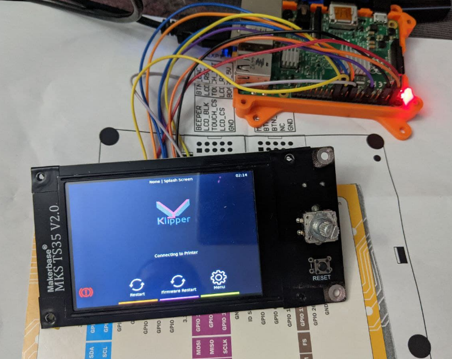 |


|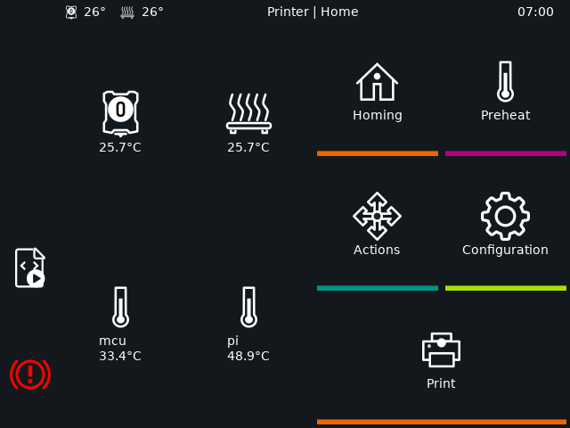|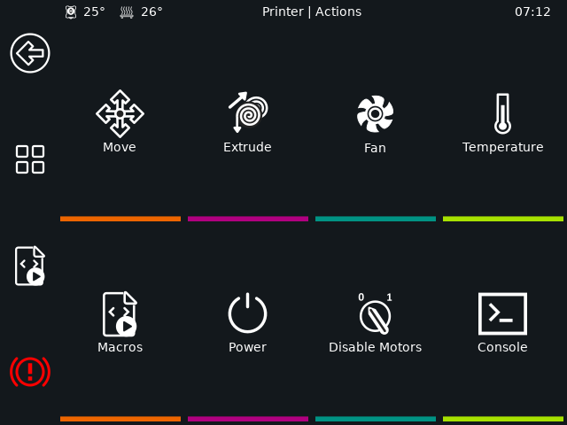| 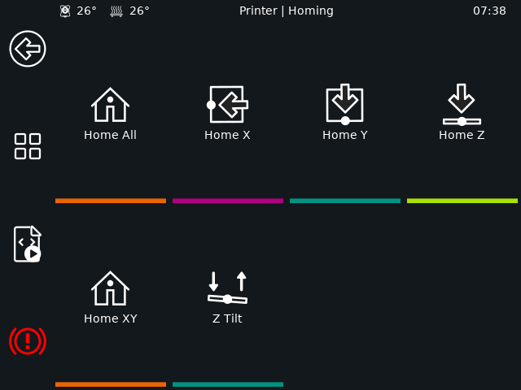| |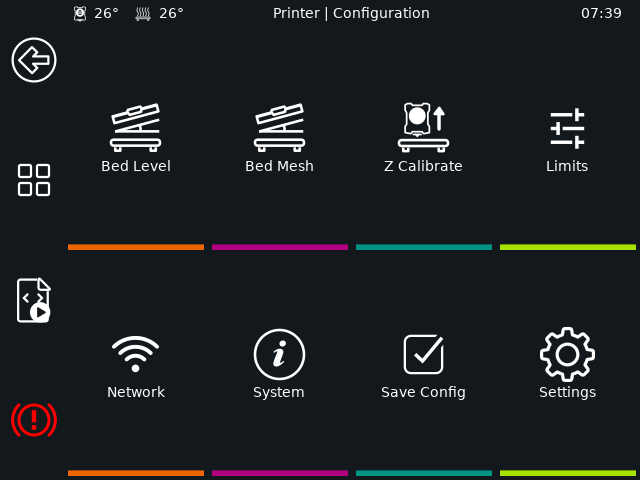   |
|---|---|---|---|---|
|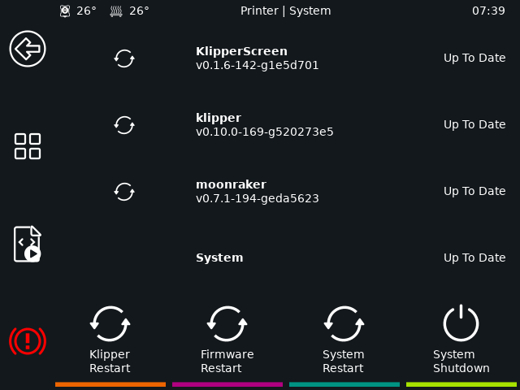|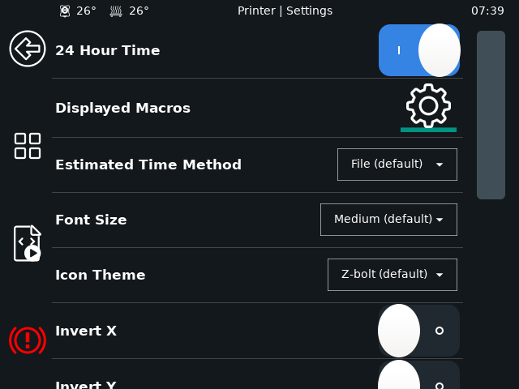| 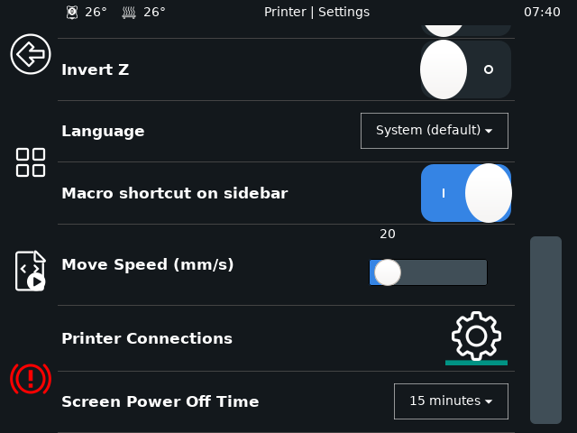|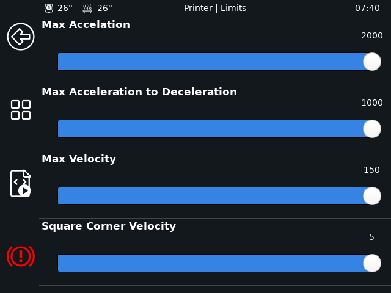|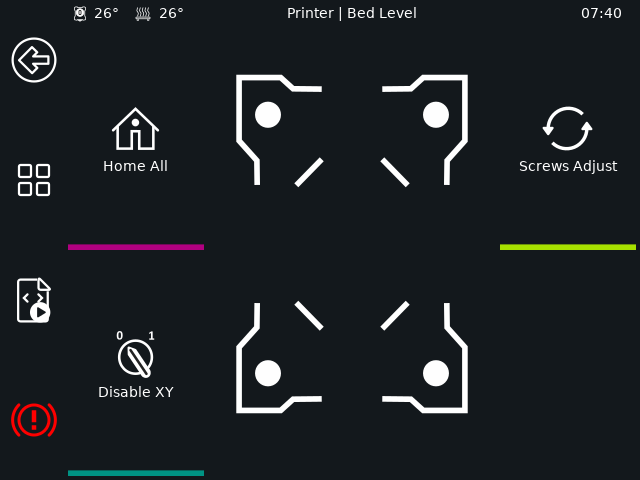|
|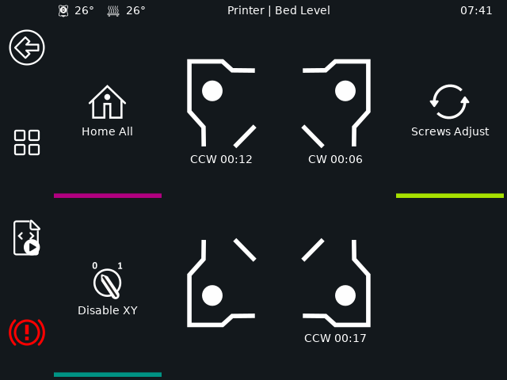|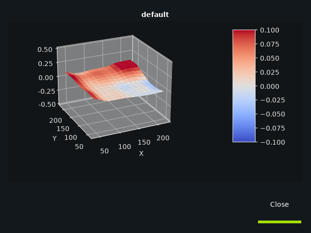|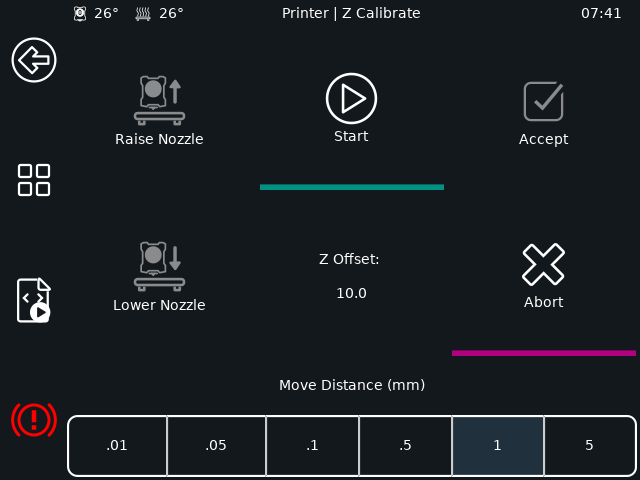|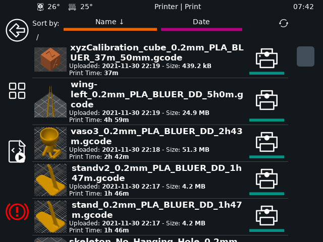|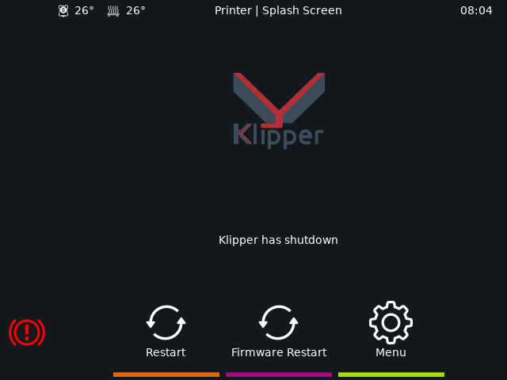|


