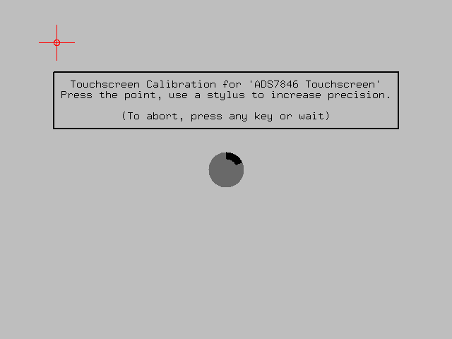
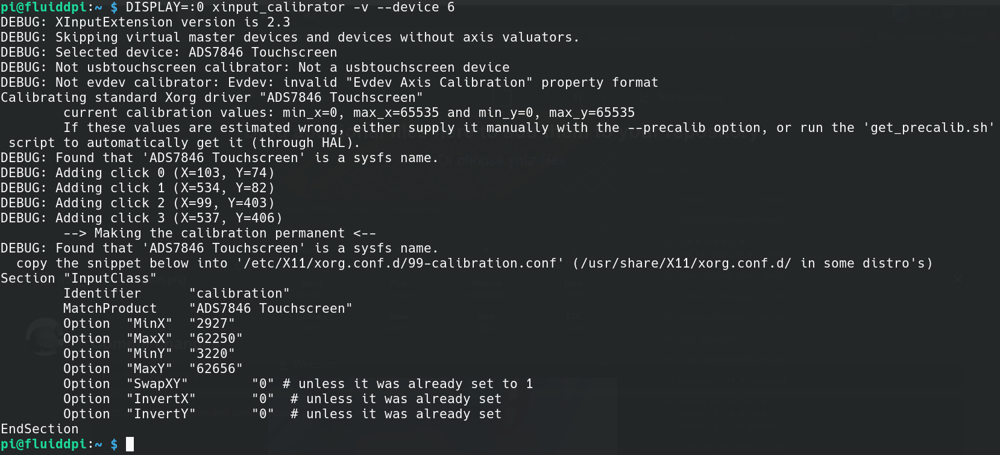
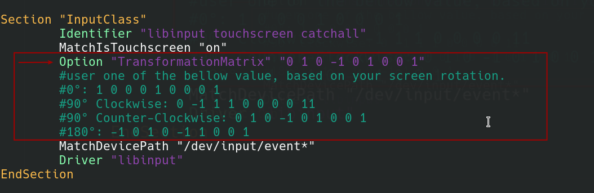

## A member of community has update this guide, (I tested and is working fine), please check it [here](https://github.com/fbeltrao-br/mksts35).


## MKS TS35 KlippeScreem port! (WIP) 

## Notes and guide on how to use MKS TS35 LCD with KlipperScreen
## Tested only on [FluidPI 1.6.2](https://github.com/fluidd-core/FluiddPI/releases/tag/v1.16.2), can't garantie same steps will work on another image, could not get it working fallowing step by step on mainsailOS

### Validaded with: MKS TS35 and MKS TS35-R V2.0


Two Trees Bluer | 
--------|
 |

MKS TS35 Guide for KlipperScreen connected to a raspberry pi via SPI : @willngton

> Note: Considering that you already have installed: Klipper + KlipperScreen using KIAUH in a clean Raspbian Lite

* 1 MKS TS35 Wiring to Raspberry PI (one may connect BEEP pin to any free gpio on PI for M300)
* Chipset is: 
```
MKS_TS35_V2_0
ADS7843E  / ILI9341  - ST7796
```


PINOUT | 
--------|
 |


* 2 Add the fallowing lines on your /boot/config.txt, this will force screen size to match with TS35, enable SPI and tinylcd35 dtoverlay:
* You can compare your config.txt with the one here that is tested and working, some pre-build images (mainsailOS, fluiddOS) has sone options enable that prevent tiny35 from load, or make a backup and use the oen provides here for teste. 
 Link for working config.txt :  https://github.com/willngton/3DPrinterConfig/edit/main/mks_ts35/config.txt


```
$sudo nano /boot/config.txt

 * add bellow content to the end and salve (crt+x)

###### MKS TS35
hdmi_force_hotplug=1
hdmi_cvt=hdmi_cvt=400 300 60 1 0 0 0
hdmi_group=2
hdmi_mode=1
hdmi_mode=87
display_rotate=0

dtparam=spi=on
dtoverlay=tinylcd35,rotate=270,speed=36000000,touch,touchgpio=23,fps=10 # MKS TS35 Rotated 270 (for fit on Two Trees Bluer)
```
* 3 Install rpi-fbcp for screen redirection.
```
sudo apt-get install cmake
cd ~
sudo git clone https://github.com/tasanakorn/rpi-fbcp
cd rpi-fbcp/
sudo mkdir build
cd build
sudo cmake ..
sudo make
sudo install fbcp /usr/local/bin/fbcp
```

* 4 Replace tinylcd35 dtoverlay for the one found on:
>https://forums.raspberrypi.com/viewtopic.php?t=281695

>https://drive.google.com/file/d/1naCs1F-VGU9CJnzmOeAstpQY-9Bypno2/view?usp=sharing

Download, put the file in klipper document by using WIN SCP. 
Then replace using the following command (Use the link as tinylcd35.dtbo.2 in the forum instead of 1) 
```
sudo cp tinylcd35.dtbo.2 /boot/overlays/tinylcd35.dtbo
```

* 5 Add  "fbcp &" to /etc/rc.local or create a service entry
  > Use your favorite text editor and add "fbcp &" to your rd.local in order get it up at boot time.
```
sudo nano /etc/systemd/system/fbcp.service
 
- add the content bellow to the file, note the it will only start after KlipperScreen.service

[Unit]
Description=fbcp
After=KlipperScreen.service
StartLimitIntervalSec=0
[Service]
Type=simple
Restart=always
RestartSec=1
User=root
ExecStart=/usr/local/bin/fbcp

[Install]
WantedBy=multi-user.target

- Save (Ctrl + X) and close.

- Enable services:

sudo systemctl enable fbcp.service

```

PLEASE Reboot Host and connect back via ssh before next step. (If you are using Pi Zero 2, you may need to unplug the cable and plug in again)


* 6 Install xserver-xorg-input-evdev
```
sudo apt-get install xserver-xorg-input-evdev
```
sudo apt install xserver-xorg-video-fbdev 


### Touch Screen Configuration - Semi-automated, this will enable touch using ADS7846
> Manual process bellow was more based on try-error, fallowing Klipperscreem oficial guide here is a better way.

- Install xinput-calibrator
  ```
  sudo apt install xinput-calibrator

  ```

- Run this command to get your device id:
  ```
  DISPLAY=:0 xinput_calibrator --list
  
  output should be something like this:
  Device "ADS7846 Touchscreen" id=6
  ```
 - Using the ID of your display and put it in the following command:
    ```
     DISPLAY=:0 xinput_calibrator -v --device <id from last command>
     
    Example: $ DISPLAY=:0 xinput_calibrator -v --device 6
    ```
  - Fallow instruction on the screen to calibrate, and save content on file (create one if does not exists:
    ```
    $ sudo mkdir -p /etc/X11/xorg.conf.d/
    $ sudo nano /etc/X11/xorg.conf.d/99-calibration.conf

    ```

Calibration Screen | 
--------|
 |

Calibration Result | 
--------|
|
    


## Touchscreen touch rotation

If your touchscreen isn't registering touches properly after the screen has been rotated, you will need to apply a transformation matrix.
FluiddOS [40-libinput.conf](https://raw.githubusercontent.com/willngton/3DPrinterConfig/main/mks_ts35/40-libinput.conf).
You can have the matrix be one of the following:

  - 0°: 1 0 0 0 1 0 0 0 1
  - 90° Clockwise: 0 -1 1 1 0 0 0 0 1
  - 90° Counter-Clockwise: 0 1 0 -1 0 1 0 0 1
  - 180°: -1 0 1 0 -1 1 0 0 1
    
### Find session _libinput touchscreen catchall_ on file: sudo nano /usr/share/X11/xorg.conf.d/40-libinput.conf and add transformation matrix, reboot and touch should be calibrated.

    
    
    
> Old manual process only for reference 

## (skip this if you installed fallowed process) Touch Screen Configuration - Manual Process, this will enable touch using ADS7846

### if you have issue with calibratoin of the screen due, here is a ellagant solution provided by user: achenakid 
https://github.com/willngton/3DPrinterConfig/issues/1


* 7 If does not exists, create a file on /usr/share/X11/xorg.conf.d/99-fbturbo.conf with the fallowing content, you may need to try /dev/fb0 or /dev/fb1 based on if you get output or not.

```
# This is a minimal sample config file, which can be copied to
# /etc/X11/xorg.conf in order to make the Xorg server pick up
# and load xf86-video-fbturbo driver installed in the system.
#
# When troubleshooting, check /var/log/Xorg.0.log for the debugging
# output and error messages.
# Run "man fbturbo" to get additional information about the extra
# configuration options for tuning the driver.

Section "Device"
        Identifier      "Allwinner A10/A13/A20 FBDEV"
        Driver          "fbturbo"
        Option          "fbdev" "/dev/fb0"
        Option          "SwapbuffersWait" "true"
EndSection

```

* 8 If does not exists, create a file on - /etc/X11/xorg.conf.d/99-calibration.conf with the fallowing content.

> For Two Trees Bluer, diplay need to be installed rotated 270, therefore calibarion point should be.
```
Section "InputClass"
        Identifier      "calibration"
        MatchProduct    "ADS7846 Touchscreen"
        Option  "Calibration"   "227 3936 3880 268"
        Option  "SwapAxes"      "1"
        Option "EmulateThirdButton" "1"
        Option "EmulateThirdButtonTimeout" "1000"
        Option "EmulateThirdButtonMoveThreshold" "300"
EndSection
```

> For diplay rotated 270.
```
Section "InputClass"
        Identifier      "calibration"
        MatchProduct    "ADS7846 Touchscreen"
        Option  "Calibration"   "3936 227 268 3880"
        Option  "SwapAxes"      "1"
        Option "EmulateThirdButton" "1"
        Option "EmulateThirdButtonTimeout" "1000"
        Option "EmulateThirdButtonMoveThreshold" "300"
EndSection
```

* 9 Reboot your system

### This is based on varius tutorials, if you found a better way to do it, please share.

* 10 Troubleshooting
> You can basically fallow the steps on KlipperScreen documentation: https://klipperscreen.readthedocs.io/en/latest/Troubleshooting/

> https://forums.raspberrypi.com/viewtopic.php?t=143581

> https://forums.raspberrypi.com/viewtopic.php?t=281695


PI3 | 
--------|
 |


||| | |   |
|---|---|---|---|---|
||| |||
||||||


