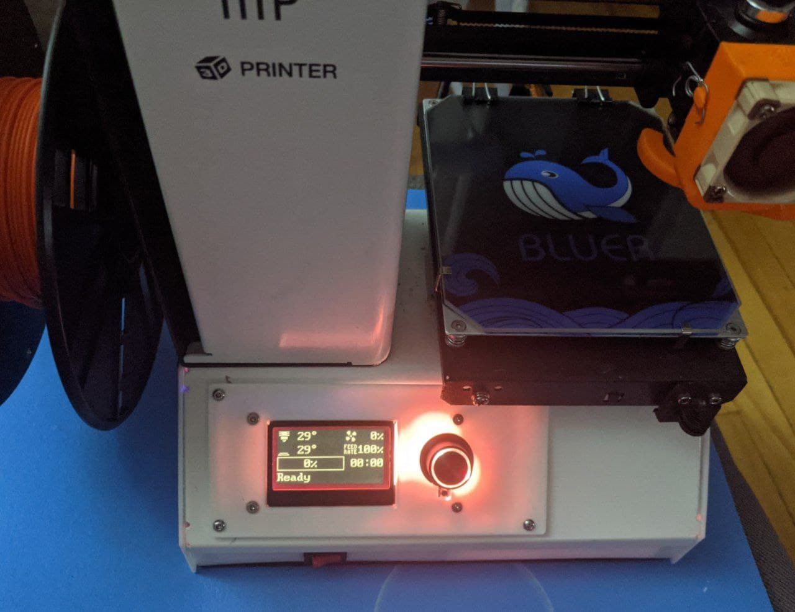

## Monoprice Select Mini V2:

  
### Machine Configuration 
  - MKS Robin E3D V1.1
  - MKS Mini 12864 v3 
  - MKS TMC 2209 - Uart
  - Internal FAN changed to Noctua 4060
  - Raspberry Pi ZeroW powered by MKS 5v pin and using PI UART.
  - Running Klipper

 

